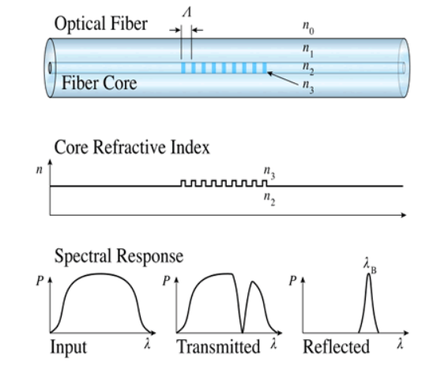
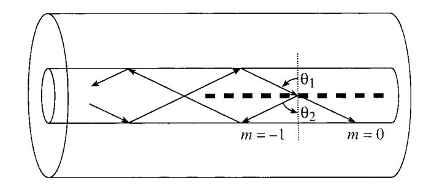
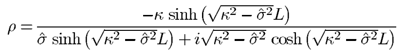
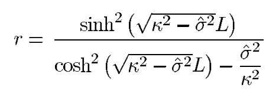
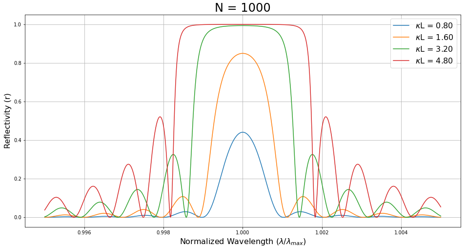

# Bragg Grating

Bragg Grating is a type of Fiber Grating, also called reflection and short-period grating, in which coupling occurs between modes traveling in opposite directions.

The AC and DC coupling coefficient parts ($\kappa$ and $\sigma$ respectively) are definded as:

$$ \sigma = \frac{2\pi}{\lambda_{D}}\overline{\delta} n_{eff}~~~~~~(1)$$

$$ \kappa = \frac{\pi}{\lambda_{D}}v\overline{\delta} n_{eff}~~~~~~(2)$$

Where $\lambda_{D} = 2 n_{eff} \Lambda$ being the design wavelength and $\Lambda = \frac{L}{N}$. The general DC self-coupling coefficient can be defined as:

$$ \hat{\sigma} = \delta + \sigma - \frac{1}{2} \frac{d\phi}{dz}~~~~~~(3)$$ 

where,

$$ \delta = 2\pi n_{eff}(\frac{1}{\lambda}-\frac{1}{\lambda_{D}})$$

then, equation (3) turns into:

$$ \hat{\sigma} = \frac{2\pi n_{eff}}{\lambda} - \sigma -  \frac{N\pi}{L} - \frac{1}{2} \frac{d\phi}{dz}~~~~~~(4)$$

The expressions for determining band edges properties (reflectivity and wavelength band) are the following:

$$ r_{band edge} = \frac{(\kappa L)^2}{1 + (\kappa L)^2}~~~~~~(5)$$

$$ \lambda_{band edge} = \lambda_{max} \pm \frac{v\overline{\delta} n_{eff}}{2n_{eff}} \lambda_{D} ~~~~~~(6)$$  

By using equations (2) and (6) it can be stated that:

$$ \lambda_{band edge} = \lambda_{max} \pm \lambda_{D} \frac{\kappa L}{\pi N}~~~~~~(7)$$  

Where $\lambda_{max} = (1 + \frac{\overline{\delta} n_{eff}}{n_{eff}}) \lambda_{D} = (n_{eff} + \overline{\delta} n_{eff}) \frac{2L}{N}$