# Microring resonator

A microring resonator is a looping photo-conductor device that utilizes resonnace phenomenon to filter or deliver energy from different silicon buses. There are originally two types of microring resonator layouts: All-pass and Add-drop.

## All-pass ring resonator 
All-pass ring resonator is its simplest form, consisting by feeding one output of a directional coupler back into its input, while the other waveguide of the pair stays unchanged, often called bus waveguide.

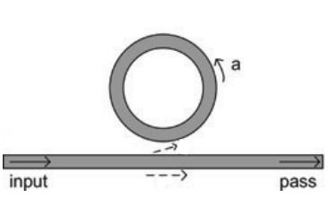

$r$ is the [self-coupling](https://opg.optica.org/oe/fulltext.cfm?uri=oe-17-21-18971&id=186494#e03) ratio and $k$ the [cross-coupling](https://opg.optica.org/oe/fulltext.cfm?uri=oe-17-21-18971&id=186494#e03) ratio.
Assuming no reflections back into the bus waveguide, the following can be stated:

$$ r = \frac{|t_{c}'|}{\alpha_{c}'} $$  

$$ k = \frac{|k_{c}'|}{\alpha_{c}'} $$

$$ (\alpha_{c}')^2 = |t_{c}'|^2 + |k_{c}'|^2 $$ 

Where $t_{c}'$ and $k_{c}'$ are the self-coupling and cross-coupling coefficients at the ring respectively. $\alpha_{c}'$ is the loss function at the ring, so that $\alpha_{c}' = 1$ means no coupling loss and $\alpha_{c}' = 0$ full coupling loss. Note that $r^2 + k^2 = 1$.

Knowing $t_{r}'$ as the ring back-coupling coefficient, it can be defined the single-pass amplitude transmisstion, including both propagation loss in the ring and loss in the couplers:

$$ a = |t_{r}'|\alpha_{c}' $$  

It relates to the power attenuation coefficient $\alpha$ [1/cm] as $a^{2} = e^{-\alpha L}$, with $L$ being the round trip length.

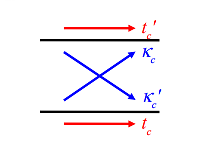 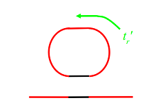

The basic spectral properties of an All-pass-filter (APF) ring resonator can easily be derived by assuming continuous wave (CW) operation and matching fields. Assuming no reflections back into the bus waveguide, can be stated that the ratio between the transmited and incident field on it is:

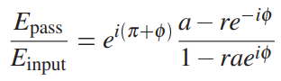 <em>(eq.1)</em>

where $\phi = \beta L$ is the single-pass phase shift with $\beta$ being the [Propagation constant](https://www.rp-photonics.com/propagation_constant.html). Notice that, if we know that $\beta = \frac{2\pi}{\lambda}$, then $\phi$ can be represented in funcion of wavelength as:

$$ \phi = \frac{2\pi L}{\lambda} $$

By squaring the (eq.1) it can be obtained the intensity transmission:

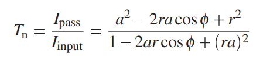 <em>(eq.2)</em>

Can be observed that the ring will be on resonance when the single-pass phase shift $\phi$ is a multiple of 2$\pi$, or when the wavelength of the light fits a whole number of times inside the [Optical length](https://www.microscopyu.com/tutorials/specimen-optical-path-length-variations) of the ring:

 <em>(eq.3)</em>

The effective phase shift $\varphi$ induced by the ring resonator can be calculated manipulating (eq.1):

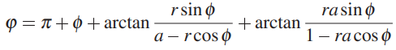 <em>(eq.4)</em>

Considering no instrinsic losses (a=1), can be plotted for different values of the self-coupling ratio coefficient r:

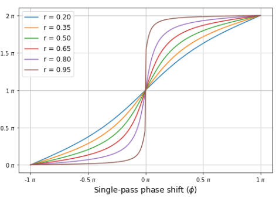 <strong><em>(Effective phase shift delay ($\varphi$) x Single-pass phase shift ($\phi$))</em></strong>

Considering $r$ = 0,85, can be plotted for different values of $a$:

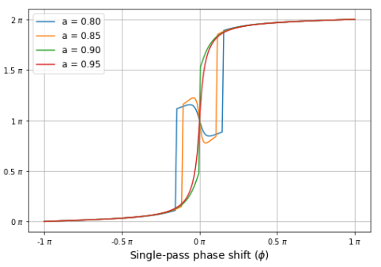 <strong><em>(Effective phase shift delay ($\varphi$) x Single-pass phase shift ($\phi$))</em></strong>

## Add-drop ring resonator

When the ring resonator is coupled to two waveguides, the incident field is partly transmitted to the drop port

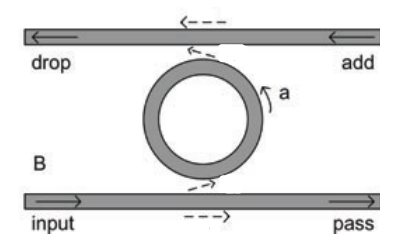

The transmission to the pass and the drop port can also be derived from continuous wave (CW) operation and matching the fields:

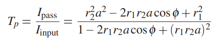(eq.5)

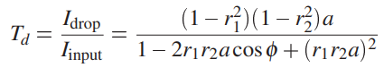(eq.6)

Where $T_{p}$ is the transmission to the pass port and $T_{d}$ the transmission to the drop port.

## Spectral characteristics of ring resonator

From equations (eq.2),(eq.5) and (eq.6) it can be derived both expressions for the full width at half maximum (FWHM) of the resonance spectrum of all-pass and add-drop ring resonators:

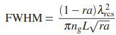(eq.7) <strong> (All-pass FWHM) </strong>

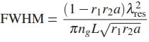(eq.8) <strong>  (Add-drop FWHM) </strong>

Within a first order approximation of the dispersion, the wavelength range between two resonances or free spectral range (FSR) in function of wavelength equals:

$$ FSR = \frac{\lambda_{c}^2}{n_{g} L} [m] $$ 

And if given in frequency range, it can be converted in wavelength range using:

$$ FSR = \frac{\lambda_{c}^2 \Delta f}{c} [m]$$ 

Where $\lambda_{c}$ is the central wavelength of the range spectrum, $\Delta f$ the frequency range, $n_{g}$ the group index and $c$ the speed of light. The group index, and the corresponding group velocity $v_{g} = \frac{c}{n_{g}}$ , describes the velocity at which the envelope of a propagating pulse travels and is a characteristic of a dispersive medium (or waveguide). As $n_{g}$ takes into account the dispersion of the waveguide, hence it can be defined by:

$$ n_{g} = n_{eff} - \lambda_{0} \frac{d n_{eff}}{d \lambda} $$

Extracting results from the equations (eq.2), (eq.5) and (eq.6), we obtain the transmission below

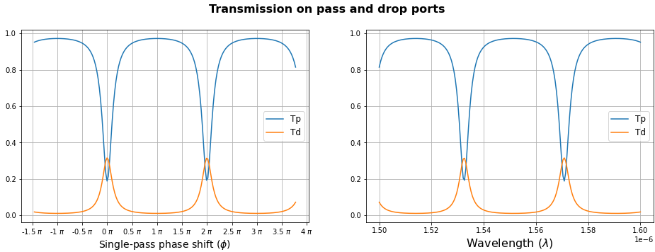

So, it can be defined two new parameters: <strong>Finesse</strong> and <strong>Q-factor</strong>

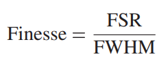  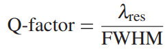

